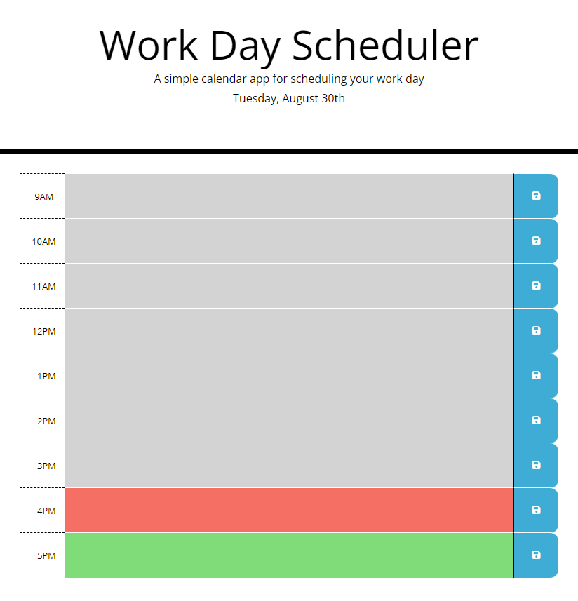

# day_scheduler

## Description:
This application consists of a business-hour Day Scheduler. The user is able to save events on this daily planner and manage time effectively.

## Preview:



# Features:

1. Current Date displayed on top of the calendar.
2. Time-blocks for standard business hours.
3. Save button - enables user to save the event to the local storage.
4. Once the page is refreshed then the events persist in the hourly-calendar.


# JavaScript

## Color Coded Hours:

- Function Color Code to identify the current, past and future hours:
    - Color Red: if the row corresponds to the current hour
    - Color Grey if the row corresponds to past hours
    - Color Green if the row corresponds to future hours

````java
function colorCode() {
    $('.hour').each(function () {
        var toNumber = parseInt($(this).data('time'));
        var textarea = $(this).siblings("textarea");
        //Color Red if the row corresponds to the current hour
        if (toNumber == currentHour) {
            textarea.addClass('present');
        //Color Grey if the row corresponds to past hours
        } else if (toNumber < currentHour) {
            textarea.addClass('past');
        //Color Green if the row corresponds to future hours
        } else {
            textarea.addClass('future')
        }
        console.log(toNumber);
    })

};
````

## Event Listener:

- Click event applied to the floppy disk, so the event is saved in the local storage.

- Function "init" : get's the information from the local storage, for each hour. So once the user clicks on the save button, the event will persist in the time-block even when the page is refreshed. 

# Link to application:

# Sources:
https://getbootstrap.com/docs/5.2/layout/grid/
https://momentjs.com/
https://api.jquery.com/each/

